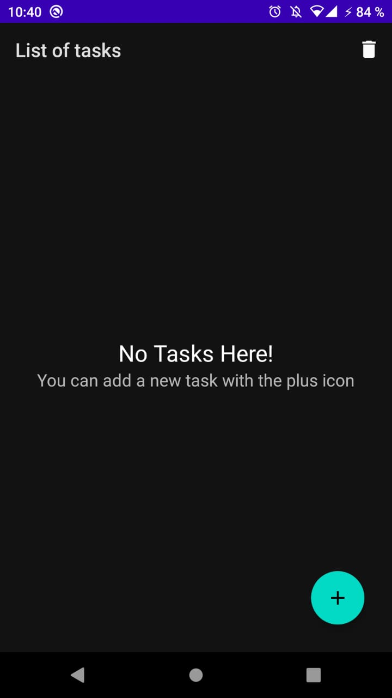
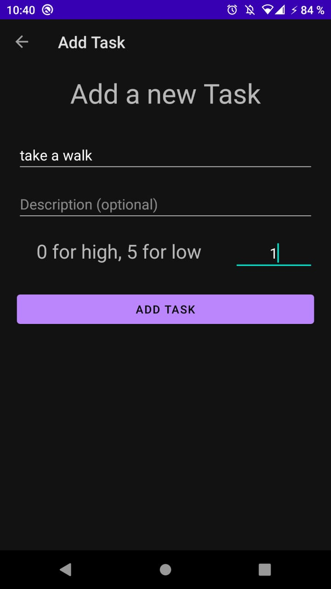
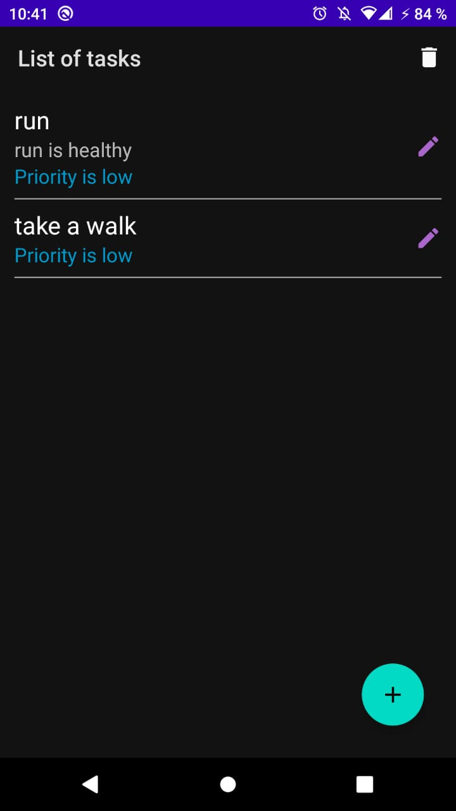

# Todo List App
This is an app for list your pending tasks and complete them.

## Installation
 This is an Android Studio Project. You just clone the repo; next open in your IDE and run!

## Compatibility
This app was created with minimun API Level 16.

## Features
- MVVM Pattern.
- Recyclerview
- Fragment Navigator
- Room for database
- Constraint Layout

## Screens
| List of tasks (empty) | Create new Task | List of tasks |
|--|--|--|
|  |  |  |